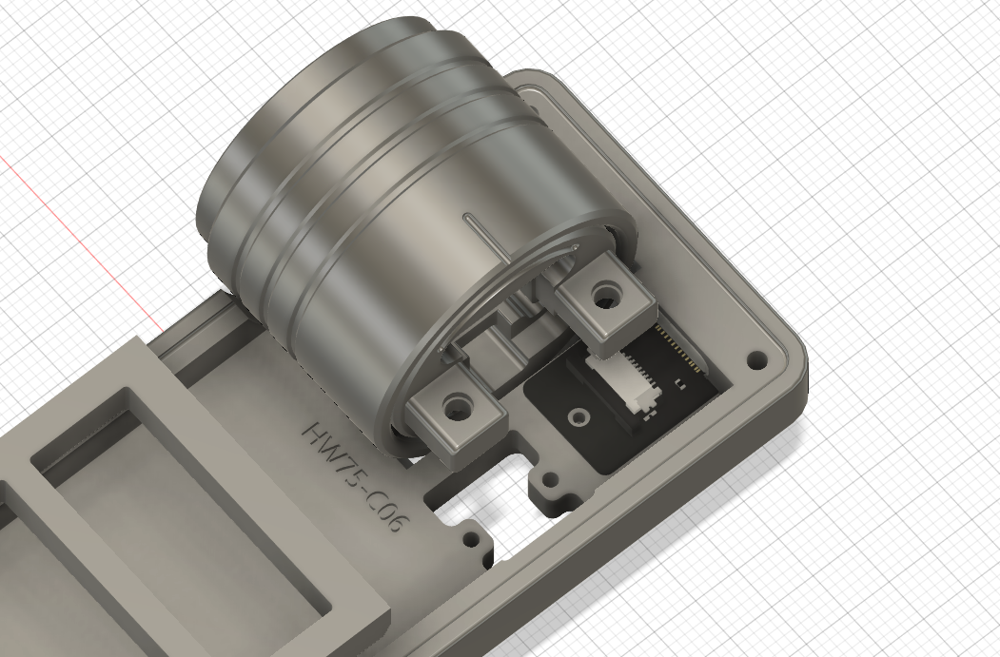
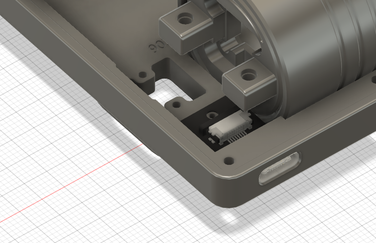

# HelloWord-Keyboard-Dynamic
 瀚文键盘Dynamic模块复刻

****针对只复刻模块的朋友****

## 1、需要打印的PCB

源立创工程中的   

| 05 拓展板-Ctrl | 09 拓展板-OLED | 10 拓展板-Encoder |
| -------------- | -------------- | ----------------- |

以及本项目中的 **BaseConnectorForDynamic**  为Type-c转换小板  如图：

## 2、更换打印模型  底壳更换即可

